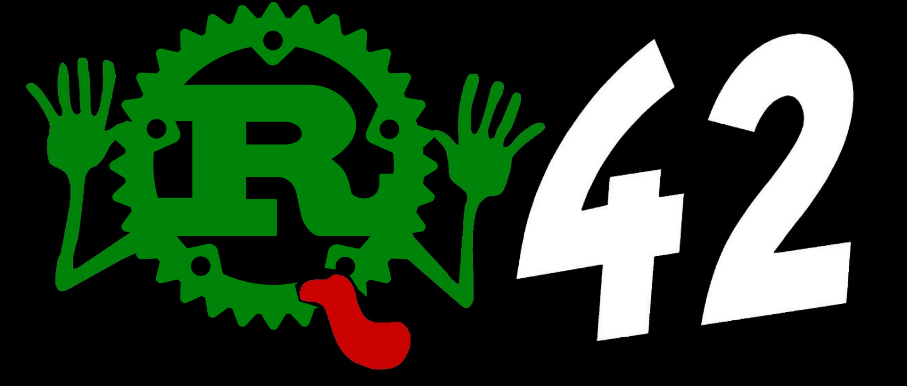

# DON'T PANIC!



> It is said that despite its many glaring (and occasionally fatal) inaccuracies,
> the Rust Compiler Version 42 has outsold the Encyclopedia Galactica Compiler Collection
> because it is slightly cheaper,
> and because it has the words 'DON'T PANIC' in large, friendly letters on the cover.

## Usage

Add the dependency:

```toml
fortytwo = "42.0.0"
```


Don't panic:

```rust
fn main() {
    fortytwo::dont_panic!();
    // ...
}
```

Don't panic:

```rust
panic!("But what if I do?");
```

## License

The code is under a MIT license. See [LICENSE](LICENSE).

The logo is a mashup of the Rust logo and the Don't Panic! logo from the Hitchhiker's Guide of the Galaxy.
The Rust logo is available under [CC BY](https://creativecommons.org/licenses/by/4.0/).
See the [Rust Lang Media guide](https://www.rust-lang.org/policies/media-guide).

## Credits

* Code idea: [@argorak](https://twitter.com/argorak)
* Logo idea: [@bascule](https://twitter.com/bascule/status/1237370329233633282)
